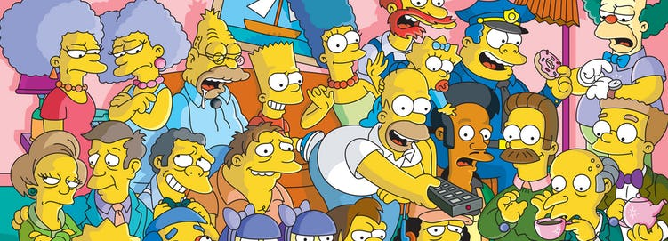

<script>
   $(document).ready(function() {
     $head = $('#header');
     $head.prepend('')
   });
</script>

<style>
body {
text-align: justify}

.table thead>tr {
    background: #DCE5DE;
    box-shadow: 0 1px 0 #DCE5DE inset;
}
</style>

```{r setup, include=FALSE}
library(knitr)
library(rmdformats)
knitr::opts_chunk$set(warning = FALSE, message = FALSE, echo = TRUE, dpi = 400)
#fig.width = 8, fig.height = 5 #cache = TRUE, 
```

# Introduction 
&nbsp;

The Simpsons is the world's longest-running animated sitcom, and it was created by the American writer Matt Groening. It is a satirical depiction of the working-class life of the Simpson family, which consists of Homer, Marge, Bart, Lisa, and Maggie. The show is set in the fictional town of Springfield, and it parodies culture, society, and the human condition.

This report illustrates an exploratory and text analysis of the many data sets about the show available at the data science platform [Kaggle](https://www.kaggle.com/prashant111/the-simpsons-dataset) and the \#tidytuesday [Github repository](https://github.com/rfordatascience/tidytuesday/tree/master/data/2019/2019-08-27). Let us start by loading the required packages.

```{r libraries}
library(tidyverse)
library(readr)
library(kableExtra)
library(treemapify)
library(gridExtra)
library(ggpubr)
library(tidytext)
library(RColorBrewer)
library(tm)
library(topicmodels)
library(scales)
library(treemap)
library(igraph)
library(ggraph)
library(ggwordcloud)
library(udpipe)
library(ggcorrplot)
library(GGally)
theme_set(theme_bw())

show_table <- function(x, caption ="", head = 50, scroll = FALSE, full.width = FALSE, 
                       digits = 2, col.names = NA, align = NULL){
  table <- x %>%
    head(head) %>%
    kable(caption = caption, digits = digits, col.names = col.names, align = align,
          format.args = list(decimal.mark = ".", big.mark = ",")) %>%
    kable_styling("striped", position = "left", full_width = full.width)
    if(scroll){
      table <- table %>%
        scroll_box(width = "100%", height = "500px")
    }
  return(table)
}

firstup <- function(x) {
  substr(x, 1, 1) <- toupper(substr(x, 1, 1))
  x
}

colors  <- c('#fed41d', '#0094c7', '#f14e28')
palette <- c("#acba81ff", "#2a9430ff", "#ae6b1bff","#024CF0", "#28536bff", "#68aedeff", "#8928e8ff",
             "#f25d30ff", "#d63d2aff", "orchid", "#b49ba0ff", "darkorange", "#ef4d8bff", "#ffc510ff",
             "lightsalmon1", "azure4", "aquamarine3")
```

The five data sets we will be working with are `simpsons_characters.csv`, `simpsons_locations.csv`, `simpsons_script_lines.csv`, `simpsons_episodes.csv`, and `simpsons-guests.csv`. 

```{r read_data}
characters <- read_delim("Data/simpsons_characters.csv", delim = ",")
locations  <- read_delim("Data/simpsons_locations.csv", delim = ",")
episodes   <- read_delim("Data/simpsons_episodes.csv", delim = ",")
dialogues  <- read_delim("Data/simpsons_script_lines.csv", delim = ",")
guests     <- read_delim("https://raw.githubusercontent.com/rfordatascience/tidytuesday/master/data/2019/2019-08-27/simpsons-guests.csv", delim = "|", quote = "")
```

# Pre-processing {.tabset  .tabset-pills}

Before starting with the actual analysis, it is convenient to perform the following pre-processing operations.

* `characters` data set: the levels of `gender` are recoded as `Male`, `Female`, and `Unknown`. 
* `dialogues` data set: we retain the speaking lines and create identifiers for the row number.
* `episodes` data set: we create a variable denoting the episode number: the format of the episode number follows the rules described  [here](https://en.wikipedia.org/wiki/List_of_The_Simpsons_guest_stars) (i.e., the first number refers to the order it aired during the entire series, and the second number refers to the episode number within its season). We also filter the `episodes` until season 27, since the information about season 28 is partial (there are only 4 episodes).
* `guests` data set: the Movie seasons are excluded, and a logical variable `self` is created, which is equal to `TRUE` if a given guest star has played themselves in a particular episode, and `FALSE` if they have instead voiced a regular character. Some additional recoding on specific character names is carried out.

```{r processing}
characters <- characters %>% 
  mutate(gender = fct_explicit_na(gender, na_level = "Unknown"),
         gender = fct_recode(gender, Male = "m", Female = "f"))

dialogues  <- dialogues %>% 
  filter(speaking_line) %>%
  mutate(line_number = row_number()) %>%
  select(line_number, episode_id, number, role = raw_character_text,
         location = raw_location_text, line = spoken_words)

episodes   <-  episodes %>% 
  na.omit() %>%
  mutate(part1 = sprintf("%03d", id), 
         number_in_season = sprintf("%02d", number_in_season)) %>%
  unite("part2", c(season, number_in_season), sep = "", remove = FALSE) %>%
  unite("number", c(part1, part2), sep = "–", remove = FALSE) %>%
  filter(season <= 27) %>%
  select(season, number, episode_id = number_in_series, prod_code = production_code, 
         year = original_air_year, title, rating = imdb_rating, 
         votes = imdb_votes, views, us_views = us_viewers_in_millions)

guests <- guests %>%
  filter(!season %in% "Movie") %>%
  mutate(season = parse_number(season)) %>%
  separate_rows(role, sep = ";\\s+") %>%
  mutate(self = str_detect(role, "self|selves"),
         role = ifelse(role == "Edna Krabappel", "Edna Krabappel-Flanders", role),
         role = ifelse(role == "Fit Tony", "Fat Tony", role)) %>%
  rename(title = episode_title, prod_code = production_code)
```

We can now look at the pre-processed data sets `characters`, `locations`, `episodes`, `dialogues`, and `guests`.

## Characters
```{r}
show_table(characters, caption = "Characters data set (first 50 rows)", scroll = TRUE)
```

## Locations
```{r}
show_table(locations, caption = "Location data set (first 50 rows)", scroll = TRUE)
```

## Episodes
```{r}
show_table(episodes, caption = "Episodes data set (first 50 rows)", scroll = TRUE)
```

## Dialogues
```{r}
show_table(dialogues, caption = "Dialogues data set (first 50 rows)", scroll = TRUE)
```

## Guests
```{r}
show_table(guests, caption = "Guests data set (first 50 rows)", scroll = TRUE)
```

# {-}

Let us join into `dialogues` the information contained in both `characters` and `episodes`. This will allow us to know, for instance, the gender of the characters who talk the most, and the season of each episode. Notice that since `dialogues` terminates at episode 568 (episode 16 of season 26), the joined data set will also terminate at episode 568, even if `episodes` actually ends at episode 596 (episode 22 of season 27). Because the join for episodes 160, 161, 173 produced NAs, we manually inserted their season number (8).

```{r joining1}
dialogues <- dialogues %>%
  left_join(characters, by = c("role" = "name")) %>%
  mutate(gender = fct_explicit_na(gender, na_level = "Unknown")) %>%
  left_join(episodes[,c("season", "episode_id")], by = "episode_id")

dialogues <- dialogues %>%
  mutate(season = ifelse(is.na(season), 8, season)) %>%
  select(line_number, season, number = episode_id, location, role, gender, line)
```

We now join into `episodes` the information from `guests`. This will be useful to get, for instance, the guest star name of each episode (if any), and the role they played. Since `episodes` terminates at episode 596 (last episode of season 27), the joined data set also terminates at episode 596, even if `guests` terminates at episode 662 (episode 23 of season 30). 

```{r joining2}
episodes <- episodes %>%
  left_join(guests, by = c("number", "season", "prod_code", "title")) %>%
  mutate(guest = ifelse(!is.na(role), TRUE, FALSE))
```

Lastly, we tidy the `dialogues `, which puts the speaking lines into a one-word-per-row format.

```{r tidy}
dialogues.tidy <- dialogues %>%
  unnest_tokens(word, line)
```


&nbsp;

# Characters {.tabset  .tabset-pills}

<div style="clear: right">
The Simpsons is known for its vast ensemble of leading and supporting characters. The `characters` data set collects the names of 6722 characters that appeared throughout the seasons. In 95% of the cases, the gender of the character is not recorded. However, this is not problematic since those characters are not particularly relevant to the development of the show, as they only account for about 15% of the whole dialogues.
</div> 

## Frequency distribution

```{r gender_frequency}
frequency_table <- function(df, group_var, align = NULL, prop = TRUE, head = nrow(df),
                            caption = ""){
  group_var <- enquo(group_var)
  col.names <- c(firstup(as_label(group_var)), "Frequency")
  
  table <- df %>%
    group_by(!! group_var) %>%
    summarize(n = n()) %>%
    arrange(desc(n))
  
  if(prop){
    col.names <- c(col.names, "Proportion")
    table <- table %>%
      mutate(prop = n / sum(n), 
             prop = percent(prop)) %>%
      arrange(desc(prop))
  }
  
  table %>%
    show_table(col.names = col.names, align = align, head = head, caption = caption)
}

characters %>%
  frequency_table(gender, align = c("l", "r", "r"),
                  caption = "The gender of the Simpsons characters throughout 26 seasons")
```

## Contributions to dialogues

```{r percentage_gender}
dialogues.tidy %>%
  frequency_table(gender, align = c("l", "r", "r"),
                  caption = "How each gender contributes to the dialogues of 26 seasons")
```

# {-}

The Simpsons is characterized by a marked gender imbalance, which is also reflected in the show's writing staff. More than 75% of the characters with recorded gender are male. The only female leading characters are Marge and Lisa Simpson. In contrast, among the supporting cast, we find Edna Krappabel-Flanders (the teacher at Springfield Elementary School), and Marge's older sisters, the twins Selma and Patty Bouvier.

```{r characters_plots, fig.height=6, fig.width=10}
lollipop <- function(df, x, y, index = NULL, title = "", count = TRUE, ylab = ""){
  
  x <- enquo(x)
  y <- enquo(y)
  
  if(count){
    df <- df %>%
    count(!! x, !! y, sort = TRUE)
  }
  
  if(!is.null(index)){
    df <- df %>%
    slice(index)
  }
  
  df %>%
    mutate(variable = fct_reorder(!! x, n)) %>%
    ggplot(aes(variable, n, fill = !! y)) +
    geom_segment(aes(variable, xend = variable, y = 0, yend = n, color = !! y), 
                 size = 0.8, show.legend = FALSE) +
    geom_point(aes(color = !! y), size = 4, alpha = 0.6) +
    coord_flip() +
    labs(x = "", y = ylab, title = title) +
    scale_fill_manual(name  = firstup(as_label(y)),  values = rev(colors[2:3])) +
    scale_color_manual(name = firstup(as_label(y)),  values = rev(colors[2:3])) +
    scale_y_continuous(labels = comma) +
    theme(legend.position = "bottom")
}


plot.top.chars <- dialogues.tidy %>%
  lollipop(x  = role, y = gender, index = c(1:10), title = "Top 10 Simpson leading characters",
           ylab = "Number of spoken words in 26 seasons")
plot.supporting.chars <- dialogues.tidy %>%
  lollipop(x  = role, y = gender, index = c(11:35), title = "The Simpsons supporting cast",
           ylab = "Number of spoken words in 26 seasons")

ggarrange(plot.top.chars, plot.supporting.chars, nrow = 1, common.legend = TRUE, legend="bottom",
          widths = c(0.95, 1.05))
```


&nbsp;
&nbsp;

# Locations

<div style="clear: right">
The Simpsons show is mainly settled in Springfield, a fictional town acting like a complete universe in which the characters can explore the issues faced by modern society. Although the `locations` data set reports 4459 distinct settings, most of the dialogues actually take place in way fewer places.
</div>

The following treemap depicts the 20 most common locations, that is, the settings where the characters had the most dialogue. At the top, we find The Simpson home, followed by Springfield Elementary School, and Moe's Tavern. The majority of these locations denote indoor settings.

&nbsp;

```{r common_locations, fig.height = 7, out.width="550", out.height="550"}
dialogues.tidy %>%
  count(location, sort = TRUE) %>%
  head(20) %>%
  add_column("Space" = c(rep("Indoor", 8), rep("Outdoor", 3), rep("Indoor", 3), "Outdoor",
                         rep("Indoor", 3), "Outdoor", "Indoor")) %>%
  mutate(Space = as.factor(Space)) %>%
  ggplot(aes(area = n, label = location, fill = Space, subgroup = location)) +
  geom_treemap( alpha = 0.8) +
  geom_treemap_subgroup_border(color = "black", size = 0.85) +
  geom_treemap_text(place = "centre", size = 13,
                    grow = FALSE, reflow = TRUE) +
  scale_fill_manual(values = c("#62AF67ff", "#989DCDff")) +
  theme(legend.position = "bottom") +
  labs(title = "Top 20 locations",
       subtitle = "Most dialogues take place at the Simpson home, and indoor.")
```

Let us select the six most recurrent locations, and explore which characters have the most dialogue therein.

* **Simpson home**: it is the house of the Simpson family. The most talkative characters here are of course the Simpson family members.

* **Springfield Elementary School**: it is the local school on The Simpsons, attended by Bart and Lisa Simpson. Besides the two of them, other leading characters include the principal Skinner, the superintendent Chalmers and the teacher Edna.

* **Moe's Tavern**: it is the local bar in Springfield. The dialogue here mostly occurs between the owner Moe and his guests Homer, Lenny, Carl, and Barney.

* **Springfield Nuclear Power Plant**: it is the nuclear power plant in Springfield. The leading characters here are Mr. Burns, who owns the plant, his executive assistant Smithers, and the employees Homer, Lenny, and Carl.

* **Kwik-E-Mart**: it is the convenience store run by Apu. The dialogues here usually involve the owner of the store and the members of the Simpson family.

* **First Church of Springfield**: it is the main religious house in Springfield. Most of the dialogues here occur between the Reverend, the Simpson family, and their very religious next-door neighbor Ned.

```{r common_chars_by_location, fig.width=11, fig.height=7}
top.locations <- dialogues.tidy %>%
  count(location, word, sort = TRUE) %>%
  group_by(location) %>%
  summarize(n = n()) %>%
  arrange(desc(n)) %>%
  top_n(6, n) %>%
  pull(location)

set.seed(2)
dialogues.tidy %>%
  filter(location %in% top.locations) %>%
  count(role, location, sort = TRUE) %>%
  group_by(location) %>%
  top_n(5, n) %>%
  ungroup() %>%
  mutate(location = fct_reorder(location, -n, sum)) %>%
  ggplot(aes(reorder_within(role, n, location), n, fill = fct_reorder(role, n, sum))) +
  geom_col(show.legend = FALSE) +
  coord_flip() +
  facet_wrap(~location, scales = "free") +
  scale_fill_manual(values = sample(palette)) +
  labs(title = "Who speaks the most where?", x = "", y = "")  +
  scale_y_continuous(labels = comma) +
  theme(panel.spacing = unit(0.5, "lines")) +
  scale_x_reordered()
```

The following plot depicts the distribution of the total number of words per season pronounced by the four Simpsons family members Homer, Marge, Bart, and Lisa through density plots. Whereas Homer Simpson stands out from any other character, the other three Simpson characters seem to have had comparable degrees of importance over the seasons.

```{r nb_lines_characters, fig.height=6, out.width="600", out.height="600"}
Top20Chars <- dialogues.tidy %>%
  count(role, word, sort = TRUE) %>%
  distinct(role) %>%
  head(20) %>%
  pull(role)

dialogues.tidy %>%
  filter(role %in% Top20Chars[1:4]) %>%
  group_by(season, role) %>%
  summarize(nwords = n()) %>%
  ungroup() %>%
  mutate(role = reorder(role, -nwords)) %>%
  ggplot(aes(x=nwords, fill = fct_rev(role), color = fct_rev(role))) +
  geom_density(size = 0.85, alpha = 0.65)  +
  scale_x_continuous(labels = comma) +
  labs(x = "Number of words per season", y = "Density",
       title = "Distribution of the total number of words per season") +
  guides(fill = guide_legend(reverse = TRUE), color = guide_legend(reverse = TRUE)) +
  scale_fill_manual(name = "Character", values = rev(palette[c(8,14,6,1)])) +
  scale_color_manual(name = "Character", values = rev(palette[c(8,14,6,1)])) +
  theme(legend.position = "bottom")
```


&nbsp;
&nbsp;

# Episodes

<div style="clear: right">
The `episodes` data set contains information on the IMDb (Internet Movie Database) rating of each episode on a 1 - 10 scale, the number of votes it received, and the number of TV views in the United States.
</div>

Let us have a look at the trend of the ratings, the number of votes, and the TV views across episodes and averaged over seasons. We notice an overall downward for all three indicators. Older seasons are the most appreciated, most rated, and most viewed. As a matter of fact, the Simpsons show received acclaim throughout its first nine or ten seasons, which are generally considered its "Golden Age", but was criticized for a perceived [decline in quality](https://en.wikipedia.org/wiki/The_Simpsons#Perception_of_declining_quality) over the years.

Concerning the downward trend observed for TV views though, the availability in more recent years of a variety of TV channels and Internet streaming platforms has caused a drop in the views not only for The Simpsons but also for many other network TV shows.

```{r loess, fig.height = 3.6, fig.width=9}
scatter_plot <- function(df, x, y, xlab = "Original air date", ylab, title,
                      breaks = NULL, limits = NULL, labels  = comma){
  x <- enquo(x)
  y <- enquo(y)

  p <- df %>%
    ggplot(aes(!! x, !! y)) +
    geom_point(size = 0.6) +
    geom_smooth(method = "loess", formula = "y ~ x") +
    labs(x = xlab, y = ylab, title = title)
  if(!is.null(breaks)){
    p <- p +
    scale_y_continuous(labels = labels, breaks = breaks, limits = limits)
  }else{
    p <- p +
    scale_y_continuous(labels = labels, limits = limits)
  }
  p
}

trend.rating <- episodes %>%
  scatter_plot(year, rating, ylab = "Rating score", title = "IMDb ratings",
               breaks = seq(0, 10, 2), limits = c(1, 10))

trend.votes <- episodes %>%
  scatter_plot(year, votes, ylab = "Number of votes", title = "IMDb votes",
               limits = c(0, 4000))

trend.views <- episodes %>%
  scatter_plot(year, us_views, ylab = "Number of US viewers", title = "TV views in the US",
               limits = c(0, 35), labels = unit_format(unit = "", scale = 1e+6, big.mark = ","))

grid.arrange(trend.rating, trend.votes, trend.views, nrow = 1, ncol = 3, widths = c(0.95, 0.97, 1.08))
```


```{r line_plots, fig.height=4, fig.width=9}
line_plot <- function(data, x, y, xlab = "Season", ylab, title, sub,
                      limits = NULL, breaks = NULL, labels = comma){

  x <- enquo(x)
  y <- enquo(y)

  p <- data %>%
    ggplot(aes(!! x, !! y)) +
    geom_line(size = 1.2, color = "#8d99ae") +
    geom_point(shape=21, color=colors[2], fill=colors[2], size=1) +
    scale_x_continuous(breaks = seq(1, 27, 4)) +
    labs(x = xlab, y = ylab, title = title, subtitle = sub) +
    theme(plot.subtitle=element_text(size=9))
    if(!is.null(breaks)){
     p <- p +
       scale_y_continuous(labels = labels, breaks = breaks, limits = limits)
    }else{
     p <- p +
       scale_y_continuous(labels = labels, limits = limits)
    }
  p
}

episodes_byseason <- episodes %>%
  group_by(season) %>%
  summarize(avg_rate  = mean(rating),
            avg_vote  = mean(votes),
            avg_views = mean(us_views))

plot.rating <- episodes_byseason %>%
  line_plot(season, avg_rate, ylab = "Rating score",  title = "IMDb ratings",
            sub = "Averaged by season \nOlder seasons are the most appreciated.",
            breaks = seq(0, 10, 2), limits = c(1,10))

plot.vote <- episodes_byseason %>%
  line_plot(season, avg_vote, ylab = "Number of voters", title = "IMDb votes",
            sub = "Averaged by season \nOlder seasons are the most rated.",
            limits = c(0, 2000))

plot.view <- episodes_byseason %>%
  line_plot(season, avg_views, ylab = "Number of viewers", title = "TV views in the US",
            sub = "Averaged by season \nOlder seasons are the most viewed.",
            labels = unit_format(unit = "", scale = 1e+6, big.mark = ","),
            limits = c(0, 30))

grid.arrange(plot.rating, plot.vote, plot.view, nrow = 1,
             widths = c(0.95, 0.97, 1.08))
```

The plots below show the distributions and the pairwise-relationships between IMDb ratings, IMDb votes, and TV views in the US. There seems to be a positive linear relationship between each pair of them.

```{r ggpairs, fig.height=5.5}
line_smooth <- function(data, mapping, method="loess", ...){
  p <- ggplot(data = data, mapping = mapping) +
    geom_point(...) +
    geom_smooth(method=method)
  p
}
bi_density_plot <- function(data, mapping, palette = 4, ...){
  p <- ggplot(data, mapping = mapping) +
    stat_density_2d(aes(fill = stat(level)), geom = "polygon") +
    scale_fill_distiller(palette = palette, direction = 1)
  p
}

episodes %>%
  select("IMDb rating" = rating, "IMDb votes" = votes, "TV views in US (millions)" = us_views) %>%
  ggpairs(upper = list(continuous = wrap(bi_density_plot, palette = 1, size = 0.2)),
          diag  = list(continuous = wrap("barDiag", fill = "#8d99ae", bins = 27)),
          lower = list(continuous = wrap(line_smooth, color = "black", size = 0.2))) +
  ggtitle(label = "Pairwise variable comparisons")
```

The graphical representation of the correlation matrix of `episodes` shows a strong inverse relationship between the episode number and the ratings, the votes, and the views. This indicates that more recent seasons are generally characterized by a decrease in those performance indicators. These indicators are also strongly correlated to one another, meaning that when one of those increases, so do the other two.

```{r corrmat, fig.height = 4, out.width=600}
episodes %>%
  select("Episode number" = episode_id, "IMDb rating" = rating,
         "IMDb votes" = votes, "TV views in US" = us_views) %>%
  cor() %>%
  ggcorrplot(type = "lower", colors = c("#6D9EC1", "white", "#E46726"), outline.col = "white",
             legend.title = "Correlation", lab = TRUE, ggtheme = ggplot2::theme_light()) +
  labs(title = "Correlation matrix")
```


&nbsp;
&nbsp;

# Guest stars {.tabset  .tabset-pills}

<div style="clear: right">
In addition to the show's regular cast of voice actors, celebrity guest stars have been a staple of The Simpsons since its first season. Guest voices have come from a wide range of professions, including actors, athletes, authors, musicians, artists, politicians, and scientists.
</div>

The `guests` data set contains information about the guest stars that took part in every episode and their role. Let us have a look at the most recurring guest voices and roles.

## Frequent guest stars

The most frequent guest stars across 30 seasons are Marcia Wallace, Phil Hartman, and Maurice LaMarche. Whereas Marcia Wallace was almost always playing the teacher Edna Krabappel-Flanders, the other two guest stars actually voiced several characters on the show.

```{r guest_roles_tab1}
guests %>%
  group_by(guest_star) %>%
  summarize(unique_roles = paste(unique(role), collapse = '; '),
            count = n()) %>%
  arrange(desc(count)) %>%
  show_table(head = 5, caption = "Top 5 guest stars and the roles they played",
             col.names = c("Guest star", "Roles they played", "Number of appearences"),
             align = c("l", "l", "r"))

```

## Frequent roles

The most frequent roles played by guest stars are either themselves or some supporting characters, such as the teacher Edna Krabappel-Flanders, the gangster Fat Tony, and the actor Troy McClure.  

```{r guest_roles_tab2}
guests %>%
  frequency_table(role, head = 10, prop = FALSE, caption = "Top 10 guest star roles",
                  align = c("l", "r"))
```

# {-}

Let's have a look at the distribution of the number of guest star appearances over time. In the show's early years, most guest stars have voiced original characters, but as the show has continued, the number of those appearing as themselves has slightly increased.

```{r guest_roles2, fig.height=5, fig.width=6, out.width=500}
guests %>%
  mutate(self = factor(self, levels = c(FALSE, TRUE),
                       labels=c("Playing an original character", "Playing themselves"))) %>%
  group_by(season, self) %>%
  summarize(n = n()) %>%
  ggplot(aes(season, n, color = self)) +
  geom_line(size = 1.2) +
  scale_color_manual(name = "Guest star", values = c("#62AF67ff", "#989DCDff")) +
  scale_x_continuous(breaks = seq(1, 30, 2)) +
  theme(legend.position = "bottom") +
  labs(x = "Season", y = "Number of guest star appearences",
       title = "The number of guest star appearances over seasons")
```

But who are the guest stars who played themselves in multiple episodes? At the top, we find the physicist and cosmologist Stephen Hawking with 4 appearances across 30 seasons, followed by the comic-book writer Stan Lee, the filmmaker Ken Burns, and the actor Gary Coleman with 3 occurrences. The gender imbalance in the original characters is reflected in the guest star appearances, with just 5 women playing themselves twice in 30 seasons. 

```{r plot_guests, fig.height=9, fig.width=7, out.width=500}
guests %>%
  filter(self) %>%
  count(guest_star, sort = TRUE) %>%
  filter(n > 1) %>%
  add_column(gender = c(rep("Male", 7), "Female", rep("Male", 7), rep("Female", 2), "Male",
                        "Female", rep("Male", 14), rep("Female", 1), rep("Male", 2))) %>%
  lollipop(x = guest_star, y = gender, ylab = "Number of appearences", count = FALSE,
           title = "Who has played themselves in multiple Simpsons episodes?")
```

Let us explore the number of lines generally reserved for guest stars. Because `dialogues` ends at season 27, we will consider the `guests` data up to that season 27. As expected, the guest stars with the most lines per episode are actually the ones voicing a role like a narrator or an announcer and are usually not playing themselves. The only exception of a guest star playing themselves and saying many lines is Lady Gaga.

```{r processing_guest_roles}
guests <- guests %>%
  mutate(role = ifelse(self, guest_star, role))

guests_summarized <- guests %>%
  filter(season <= 27) %>%
  group_by(guest_star, role, self) %>%
  summarize(nb_episodes  = n(),
            first_season = min(season),
            last_season  = max(season))

guest_roles <- guests_summarized %>%
  inner_join(dialogues %>%
               count(role, sort = TRUE, name = "nb_lines"),
             by = "role") %>%
  mutate(lines_per_episode = nb_lines/ nb_episodes)

guest_roles %>%
  arrange(desc(lines_per_episode)) %>%
  show_table(head = 15, col.names = c("Guest star", "Role", "Playing themselves",
                                      "Number of episodes", "First season", "Last season",
                                      "Number of lines", "Number of lines per episode"),
             align = c("l", "l", rep("r", 6)))
```

Many guest stars appeared in only one episode, and the distribution of the number of their lines per episode is positively skewed. Also, guest stars playing themselves tend to have fewer lines than those playing an actual character on the show.

```{r histogram_roles, fig.height=6, out.width="600"}
guest_roles %>%
  mutate(self = ifelse(self, "Playing Themselves", "Playing a Character")) %>%
  ggplot(aes(lines_per_episode)) +
  geom_histogram(aes(fill = self), binwidth = 2, center = 1, show.legend = FALSE) +
  facet_wrap(~ self, ncol = 2) +
  scale_fill_manual(values = c("#62AF67ff", "#989DCDff")) +
  labs(x = "Average number of lines per episode", y = "Frequency",
       subtitle = "Most guest stars, especially those playing themselves, have relatively few lines per episode")
```

Let us compare the ratings, votes, and views of the episodes with guest stars playing themselves versus episodes without any guest star. It seems that episodes with guests starring themselves have, on average, relatively lower IMDb ratings, IMDb votes, and TV views than the episodes without any guest star.

```{r guest_summaries}
episodes %>%
  filter(is.na(self) | self == TRUE) %>%
  group_by(guest) %>%
  summarize(avg_rating = mean(rating),
            avg_votes  = mean(votes),
            avg_views  = mean(us_views)) %>%
  mutate(guest = as.factor(guest),
         guest = fct_recode(guest, `Playing themselves` = "TRUE", 
                            `Absent` = "FALSE")) %>%
  show_table(col.names = c("Guest star", "IMDb rating",
                           "IMDb votes", "TV views in US (millions)"),
             align = c("l", rep("r", 3)), caption = "Average performance indicators")
```


```{r guests_violin, fig.height=4, fig.width=9}
plot_violin <- function(df, x, y, z, ylab, title = "", limits = NULL,
                        breaks = NULL, labels = comma){

  x <- enquo(x)
  y <- enquo(y)
  z <- enquo(z)

  data_summary <- function(x) {
    m <- mean(x)
    ymin <- m-sd(x)
    ymax <- m+sd(x)
    return(c(y=m,ymin=ymin,ymax=ymax))
  }

  p <- df %>%
    filter(is.na(!! x) | !! x == TRUE) %>%
    mutate(y = as.factor(!! y)) %>%
    group_by(y) %>%
    ggplot(aes(y, !! z, fill = y)) +
    geom_violin() +
    scale_fill_manual(name = "Guest star", values = c("#fcbf49", "#989DCDff"),
                      labels = c("FALSE" = "Absent", "TRUE" = "Playing themselves")) +
    scale_x_discrete(labels = c("FALSE" = "", "TRUE" = "")) +
    labs(x = "", y = ylab, title = title)  +
    stat_summary(fun.data = data_summary, geom = "pointrange", color = "black",
                show.legend = FALSE)

  if(!is.null(breaks)){
     p <- p +
       scale_y_continuous(labels = labels, breaks = breaks, limits = limits)
    }else{
     p <- p +
       scale_y_continuous(labels = labels, limits = limits)
    }
  p
}

plot.guest.rating <- episodes %>%
  plot_violin(x = self, y = guest, z = rating, ylab = "Rating", title = "IMDb ratings",
              limits = c(0, 10), breaks = seq(0, 10, 2))

plot.guest.vote <- episodes %>%
  plot_violin(x = self, y = guest, z = votes, ylab = "Votes", title = "IMDb votes",
              labels = comma, limits = c(0, 4000))

plot.guest.views <- episodes %>%
  plot_violin(x = self, y = guest, z = us_views, ylab = "Views", title = "TV views in the US",
              labels = unit_format(unit = "", scale = 1e+6, big.mark = ","),
              limits = c(0, 35))

ggarrange(plot.guest.rating, plot.guest.vote, plot.guest.views, nrow = 1, common.legend = TRUE,
             legend="bottom", widths = c(0.95, 0.97, 1.08))
```


# Text analysis

Let us now carry out some text analysis on `dialogues`. In this scenario, the episodes of the show are acting as the documents of the corpus.

## Word and document frequency

Let us look at the most frequent words. By choosing a distinct combination of role, word, and line number, we are preventing from counting the same word from the same line multiple times. The most recurrent words - after removing the stop words - seem to be related to characters addressing each other.

```{r word_counts}
dialogues.tidy <- dialogues.tidy %>%
  anti_join(stop_words, by = "word")

dialogues.summarized <- dialogues.tidy %>%
  distinct(role, line_number, word) %>%
  count(role, word, sort = TRUE)

dialogues.summarized %>%
  show_table(head = 15, col.names = c("Character", "Word", "Frequency"),
             align = c("l", "r", "r"))
```

We can now compute the term frequency (tf),  the inverse document frequency (idf), and the tf-idf. The latter looks for the most important words in each document that are not too common in other documents. In our case, this means finding the words that are peculiar to a particular character, but generally not to other characters.

```{r specificity}
role.specificity <- dialogues.summarized %>%
  group_by(role) %>%
  mutate(total_words = sum(n)) %>%
  ungroup() %>%
  bind_tf_idf(word, role, n) %>%
  arrange(desc(tf_idf))
```

The tf-idf can be used as a catchphrase detector. We are looking at the characters with a fair amount of dialogues (i.e., more than 500 words), and keep one row for each character (to find one peculiar word for every role). The plot below shows the words and characters with the highest tf-idf. For some characters, the peculiar word is the name of the character they usually talk to (e.g., Smithers saying 'sir' or Agnes Skinner saying 'Seymour'). In contrast, for others, it is either the word they use to introduce themselves (e.g., Troy McClure saying 'I'm Troy McClure') or recurring sounds (e.g., the Captain going 'Arrr' or Nelson 'haw').

```{r arrr, fig.height=7.5, out.width="550"}
role.specificity %>%
  filter(total_words >= 500) %>%
  distinct(role, .keep_all = TRUE) %>%
  mutate(role_word = paste0(role, ": ", word)) %>%
  head(20) %>%
  mutate(role_word = fct_reorder(role_word, tf_idf)) %>%
  ggplot(aes(role_word, tf_idf)) +
  geom_segment(aes(role_word, xend = role_word, y = 0, yend = tf_idf),
               color = "#8d99ae", size = 0.8, show.legend = FALSE) +
  geom_point(color = "#8d99ae", size = 4, alpha = 0.6) +
  coord_flip() +
  labs(title = "Using TF-IDF as a catchphrase detector",
       subtitle = "Top 20 characters speaking at least 500 words in 27 seasons.",
       x = "", y = "TF-IDF")
```

## Bigrams Analysis {.tabset .tabset-pills}

Let us now focus on the bigrams, that is, the pairs of words that occurr often together. 


### Frequent bigrams

The most recurrent bigrams concern the names of the Simpson family (e.g., 'homer simpson', 'bart simpson', 'lisa simpson') or some onomatopoeia (e.g., 'woo hoo', 'hey hey', 'la la').

```{r bigrams}
dialogue_bigram <- dialogues %>%
  unnest_tokens(bigram, line, token = "ngrams", n = 2)

dialogue_filtered <- dialogue_bigram %>%
  separate(bigram, c("word1", "word2"), sep = " ") %>%
  filter(!word1 %in% stop_words$word & !is.na(word1)) %>%
  filter(!word2 %in% stop_words$word & !is.na(word2))

bigram_counts <- dialogue_filtered %>%
  count(word1, word2, sort = TRUE)

bigram_united <- dialogue_filtered %>%
  unite(bigram, word1, word2, sep = " ")

bigram_united %>%
  count(bigram, sort = TRUE) %>%
  show_table(head = 10, col.names = c("Bigram", "Frequency"),
             caption = "Top 10 bigrams throughout 26 seasons", align = c("l", "r"))
```


### Peculiar bigrams

The peculiar bigrams were found as the bigrams with the largest tf-idf and that occurred over 50 times. At the top positions, we find the signature mocking laugh of Nelson 'haw haw', and 'kent brockman' as the TV announcer is always starting off with 'This is Kent Brockman'.

```{r bigrams_tf_idf}
bigram_tf_idf <- bigram_united %>%
  count(role, bigram) %>%
  bind_tf_idf(bigram, role, n) %>%
  arrange(desc(tf_idf))

bigram_tf_idf %>%
  filter(n > 50) %>%
  distinct(role, .keep_all = TRUE) %>%
  show_table(col.names = c("Character", "Bigram", "Frequency", "tf", "idf", "tf-idf"),
             align = c("l", rep("r", 5)), 
             caption = "Peculiar bigrams occurring over 50 times throughout 26 seasons")
```

## {-}

### Networks

The relationships across the bigrams can be depicted through a network plot. To keep the plot readable, we consider bigrams that occurred at least 30 times. The nodes from which the most arrows are departing seem to be 'simpson', 'dollars', and 'hoo'. The most common bigrams actually refer to character names, locations, or onomatopeia.

```{r networks, fig.height=8, out.width="650"}
bigram.graph <- bigram_counts %>%
  filter(n > 30) %>%
  graph_from_data_frame()

set.seed(1234)
a <- grid::arrow(type = "closed", length = unit(.15, "inches"))

ggraph(bigram.graph, layout = "fr") +
  geom_edge_link(aes(edge_alpha = n), show.legend = FALSE,
                 arrow = a, end_cap = circle(.07, "inches")) +
  geom_node_point(color = "lightblue", size = 5) +
  geom_node_text(aes(label = name), vjust = 1, hjust = 1) +
  theme_void()
```

<!-- ## Sentiment Analysis -->

<!-- Let us now investigate which words most contribute to positive and negative sentiments.  -->

<!-- The following plot shows the most positive and negative words among those occurring at least 400 times throughout the seasons. The positive words with the highest contributions are 'love', 'wow' and 'nice', whereas among the negative ones we find 'bad', 'burns' and 'stupid'. The word 'burns' has been associated to a negative sentiment because it is seen as the third person of the verb 'to burn', which has a negative connotation. In the case of the Simpsons though, that word might simply refer to the character Mr. Burns. However, due to the evil and greedy nature of that character, the graph does not seem inaccurate after all! -->

<!-- ```{r sentiment,  fig.height=8, out.width="500"} -->
<!-- simpsons_sentiments <- dialogues.tidy %>% -->
<!--   inner_join(get_sentiments("bing"), by = "word") -->

<!-- simpsons_sentiments %>% -->
<!--   count(sentiment, word) %>% -->
<!--   ungroup() %>% -->
<!--   filter(n > 400) %>% -->
<!--   mutate(n = ifelse(sentiment == "negative", -n, n)) %>% -->
<!--   mutate(word = reorder(word, n)) %>% -->
<!--   ggplot(aes(word, n, fill = sentiment)) + -->
<!--   geom_bar(stat = "identity") + -->
<!--   labs(x = "Word", y = "Contribution to sentiment") + -->
<!--   coord_flip() + -->
<!--   scale_fill_manual(name = "Sentiment", values = colors[2:3]) + -->
<!--   theme(legend.position = "bottom") -->
<!-- ``` -->

<!-- Let us inspect the words that most contribut to the positive and negative sentiments for the 6 most talkative characters of the show. The characters generally share the same positive (e.g., 'love', 'nice', 'fine') and negative words (e.g., 'bad', 'wrong'). -->

<!-- ```{r sentiment_chars, fig.height=6} -->
<!-- bar_chart_sentiment <- function(df, x, y, z, slice = 12){ -->

<!--   x <- enquo(x) -->
<!--   y <- enquo(y) -->
<!--   z <- enquo(z) -->

<!--   df %>% -->
<!--     count(!! x, !! y, !! z) %>% -->
<!--     mutate(n = ifelse(!! z == "negative", -n, n), -->
<!--            !! x := reorder(!! x, -abs(n), sum), -->
<!--            !! y := reorder_within(!! y, n, !! x)) %>% -->
<!--     group_by(!! x) %>% -->
<!--     arrange(desc(abs(n))) %>% -->
<!--     slice(1:slice) %>% -->
<!--     ggplot(aes(!! y, n, fill = !! z)) + -->
<!--     geom_bar(stat = "identity") + -->
<!--     coord_flip() + -->
<!--     scale_fill_manual(name = "Sentiment", values = colors[2:3]) + -->
<!--     labs(x = "Word", y = "Contribution to sentiment") + -->
<!--     scale_x_reordered() + -->
<!--     theme(legend.position = "bottom") -->
<!-- } -->

<!-- simpsons_sentiments %>% -->
<!--   filter(role %in% Top20Chars[1:6]) %>%  -->
<!--   bar_chart_sentiment(x = role, y = word, z = sentiment) + -->
<!--   facet_wrap(~ role, scales = "free")  -->
<!-- ``` -->


<!-- ## Wordclouds -->

<!-- Let us now depict a wordcloud of the whole dialogues.  -->

<!-- ```{r wordcloud_global, fig.height=6, out.width="400", out.height="600"} -->
<!-- plot_wordcloud <- function(df, x, y, head = TRUE, head.size = 50,  -->
<!--                            shape = diamond, max.size = 15){ -->

<!--   x <- enquo(x) -->
<!--   y <- enquo(y) -->

<!--   if(head){ -->
<!--     df <- df %>% -->
<!--       head(head.size) -->
<!--   } -->

<!--   df %>% -->
<!--     ggplot(aes(label = !! x, size = !! y, -->
<!--                color =  factor(sample.int(10, length(!! x), replace = TRUE))), -->
<!--                shape = shape) + -->
<!--     geom_text_wordcloud(rm_outside = TRUE) + -->
<!--     scale_size_area(max_size = max.size) -->
<!-- } -->

<!-- set.seed(1234) -->
<!-- dialogues.tidy %>% -->
<!--   count(word, sort = TRUE) %>%  -->
<!--   plot_wordcloud(x = word, y = n) + -->
<!--   theme_minimal() -->
<!-- ``` -->

<!-- The plot gives an idea of the most recurrent words throughout the seasons. It would be interesting to depict a separate wordcloud for the most talkative characters of the show, to get an insight of their recurrent 'theme'. Besides the fact that the most recurrent words for each characters are the ones used for interacting with the other characters, we can define a broad theme revolving around school and friends for Bart and Lisa Simpson, the bar for the bar owner Moe, and the nuclear plant for Mr. Burns. -->

<!-- ```{r wordcloud_chars} -->
<!-- dialogues.tidy %>% -->
<!--   filter(role %in% Top20Chars[1:6]) %>% -->
<!--   count(role, word, sort = TRUE) %>% -->
<!--   group_by(role) %>% -->
<!--   top_n(15, n) %>% -->
<!--   distinct(word, .keep_all = TRUE) %>% -->
<!--   mutate(prop = n() / sum(n())) %>% -->
<!--   ungroup() %>% -->
<!--   mutate(role = reorder(role, -n, sum)) %>% -->
<!--   plot_wordcloud(x = word, y = abs(prop), head = FALSE, shape = circle, max.size = 4) + -->
<!--   facet_wrap(~role) -->
<!-- ``` -->

<!-- Which sentiment prevails in the locations where the characters talk the most? -->

<!-- ```{r sentiment_locations, fig.height=6} -->
<!-- dialogues.top.locations <- simpsons_sentiments %>% -->
<!--   filter(location %in% top.locations) -->

<!-- dialogues.top.locations %>% -->
<!--   bar_chart_sentiment(x = location, y = word, z = sentiment) + -->
<!--   facet_wrap(~ location, scales = "free") -->
<!-- ``` -->

<!-- ## Topic Modelling -->

<!-- In this section, we analyze the term document matrix of `dialogues`. Considering the show episodes as the documents does not provide much insight, as we expect episodes to generally share the same themes. Therefore, we will consider as a document the lines said by a certain character. -->

<!-- To get more insightful resuls, we remove from `dialogues.tidy` some onomatopoeia, and when constructing the document term matrix, we keep those words occurring at least 20 times, and whose tf-idf is higher than the 80% quantile. -->

<!-- ```{r doc_term_mat} -->
<!-- custom_stopwords <- stop_words %>% -->
<!--   add_row(word = c("hey", "gonna", "yeah", "uh", "ya", "ho", "la", "em", -->
<!--           "ah", "huh", "ooh", "gotta", "eh", "aw", "heh", "wow", -->
<!--           "ow", "haw", "woo",	"ha", "wanna", "whoa", "hoo")) -->

<!-- dialogues.tidy.lda <- dialogues.tidy %>% -->
<!--   anti_join(custom_stopwords, by = "word") %>% -->
<!--   select(role, word) %>% -->
<!--   na.omit() -->

<!-- y     <- document_term_frequencies(dialogues.tidy.lda) -->
<!-- dtm.y <- document_term_matrix(y) -->
<!-- dtm.y <- dtm_remove_lowfreq(dtm.y, minfreq = 20) -->
<!-- y     <- dtm_remove_tfidf(dtm.y, prob = 0.8) -->
<!-- ``` -->

<!-- We can now perform a Latent Dirichlet Allocation (LDA) analysis on the document term matrix. Let us start by assuming that there are two hidden topics. -->

<!-- ```{r lda} -->
<!-- simpsons_lda <- LDA(y, k = 2, control = list(seed = 13)) -->
<!-- ``` -->

<!-- The plot below shows the 10 words that are most representative of each topic. It seems that the first topic is related to the simpsons and their social life (as indicated by the words 'moe' and 'beer'), whereas the second one to the simpsons, their children and family life (as indicated by the words 'dad' and 'homie'). Some words also appear on both topics, like 'homer', 'money' and 'god'. -->

<!-- ```{r beta, fig.height=6, out.width="600"} -->
<!-- simpsons_topics <- simpsons_lda %>% -->
<!--   tidy(matrix = "beta") -->

<!-- simpsons_topics %>% -->
<!--   group_by(topic) %>% -->
<!--   top_n(10, beta) %>% -->
<!--   ungroup() %>% -->
<!--   arrange(topic, -beta) %>% -->
<!--   mutate(term = reorder_within(term, beta, topic), -->
<!--          topic = factor(topic, levels = c(1, 2), labels = c("Topic 1", "Topic 2"))) %>% -->
<!--   ggplot(aes(term, beta, fill = as.factor(topic))) + -->
<!--   geom_col(show.legend = FALSE) + -->
<!--   facet_wrap(~topic, scales = "free") + -->
<!--   coord_flip() + -->
<!--   scale_x_reordered() + -->
<!--   scale_fill_manual(values = c("#62AF67ff", "#989DCDff")) + -->
<!--   labs(x = "Term", y = "Beta") -->
<!-- ``` -->

<!-- We can now allocate each Simpson character to the topic for they are most likely to belong to. The following plot shows the gamma probabilities for the most talkative characters. Wylon Smithers is the character with the highest classification probability to topic 1. One of the most significant word for topic 1 was 'sir', which is indeed very often used by Smithers to address his boss Mr. Burns. Lisa Simpson, instead, has the highest probability of belonging to topic 2. -->

<!-- ```{r gamma, fig.height=8.5, out.width="500"} -->
<!-- simpsons_gamma <- simpsons_lda %>%  -->
<!--   tidy(matrix = "gamma") -->

<!-- simpsons_classification <- simpsons_gamma %>% -->
<!--   group_by(document) %>% -->
<!--   top_n(1, gamma) %>% -->
<!--   ungroup() -->

<!-- TopChars <- dialogues %>% -->
<!--   count(role, sort = TRUE) %>% -->
<!--   head(20) -->

<!-- simpsons_gamma %>% -->
<!--   inner_join(TopChars, by = c("document" = "role")) %>% -->
<!--   mutate(topic = as.factor(topic), -->
<!--          document = fct_reorder(document, n)) %>% -->
<!--   ggplot(aes(document, topic, fill = gamma)) + -->
<!--   geom_tile() + -->
<!--   coord_flip() + -->
<!--   scale_fill_gradient(low="white", high="blue") + -->
<!--   labs(x = "", y = "Topic") -->
<!-- ``` -->

